# High Frequency Trading Framework with Machine Learning

## Overview
This framework provides a comprehensive pipeline for high-frequency trading using advanced machine learning and deep learning techniques. It focuses on extracting actionable signals from level-II orderbook data and predicting orderbook dynamics through sophisticated modeling approaches.

## Objectives
- Extract high-quality trading signals from level-II orderbook data
- Predict orderbook dynamics using state-of-the-art machine learning techniques
- Generate profitable trading strategies with controlled risk

## Core Components

### 1. Strategy Pipeline
The framework follows a structured pipeline for signal generation and trading execution:

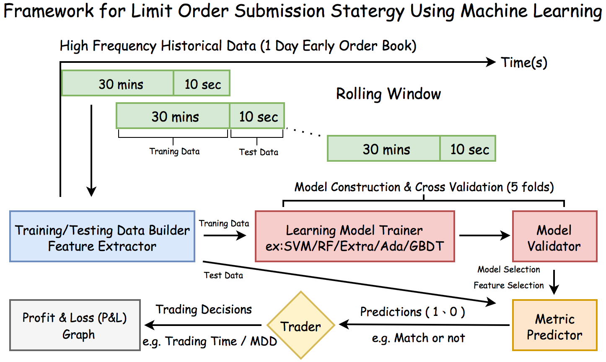

### 2. Signal Generation
The framework implements several sophisticated orderbook signals:

**Orderbook Depth Visualization**
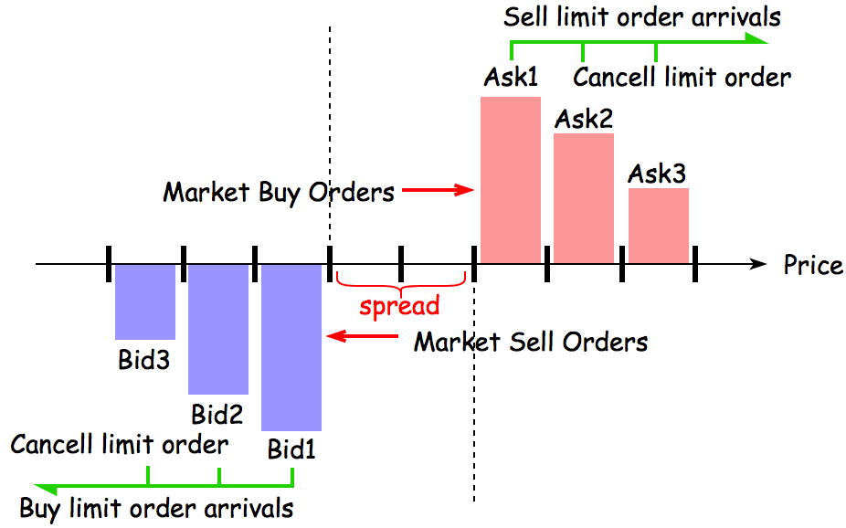

**Price Series Analysis**
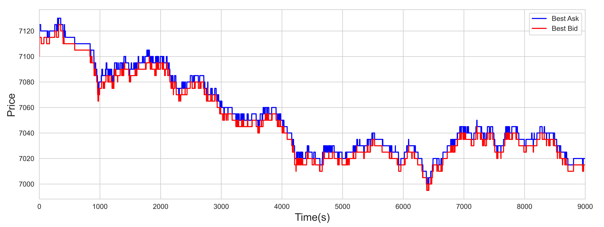

### 3. Feature Engineering & HFT Factors

**Simple Average Depth Ratio and OBI:**
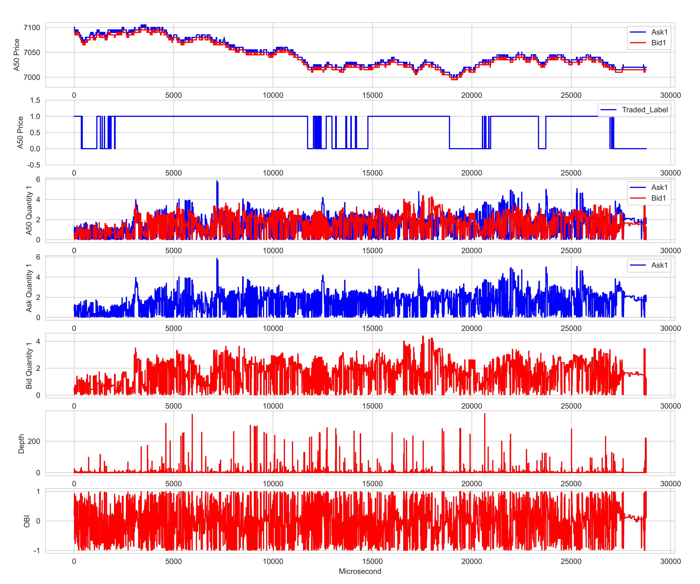
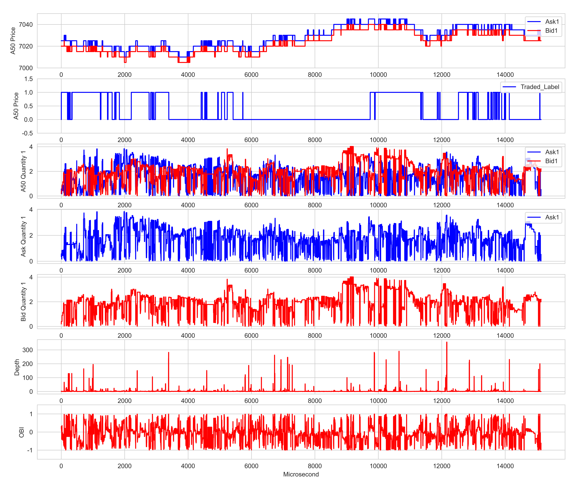

**Weighted Average Features:**
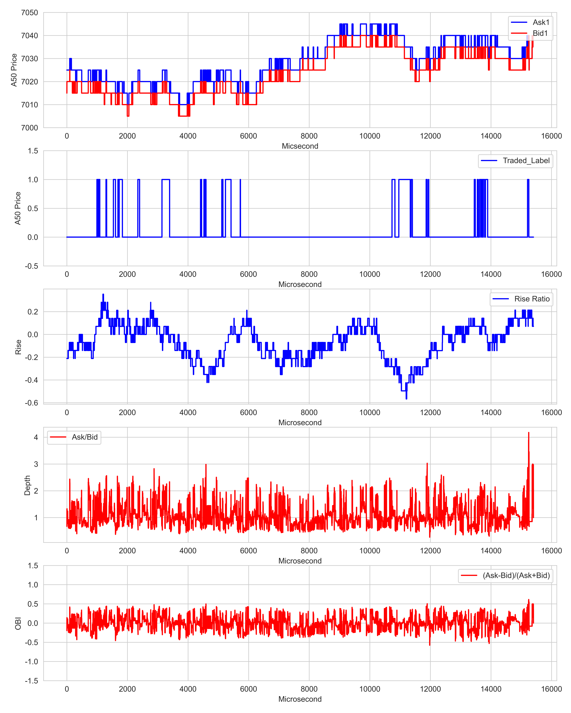

### 4. Model Architecture

#### Base Models
- Random Forest Classifier
- Extra Trees Classifier
- AdaBoost Classifier
- Gradient Boosting Classifier
- Support Vector Machines
- Neural Networks (MLP, LSTM)

#### Hyperparameter Configuration
- Training window: 30 minutes
- Testing window: 10 seconds
- Prediction horizon: 15 minutes
- Cross-validation scheme: Time-series split

### 5. Performance Analysis

**Prediction Accuracy:**
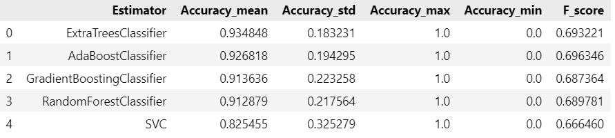

**Prediction Accuracy Series:**
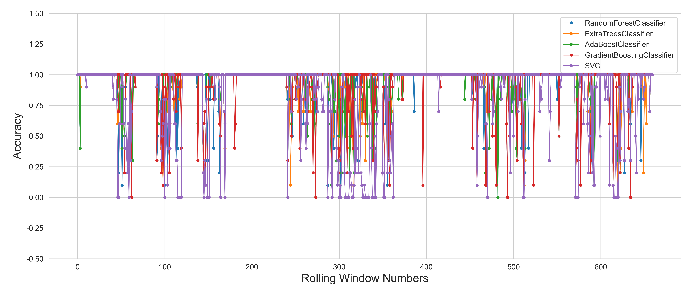

**Cross Validation Mean Accuracy:**
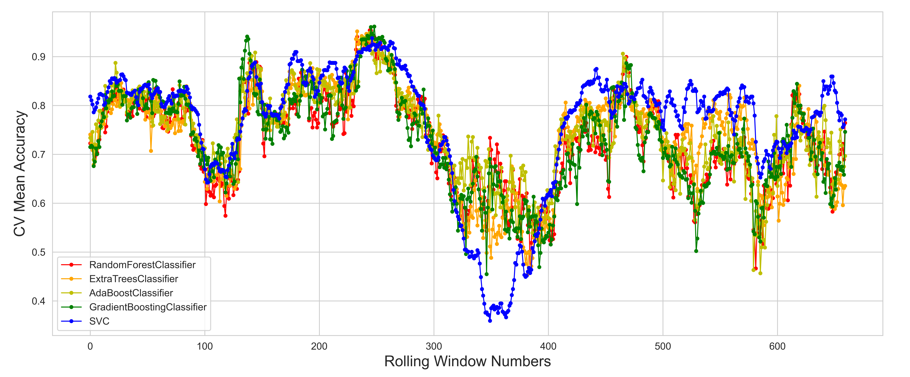

**Best Model Performance:**
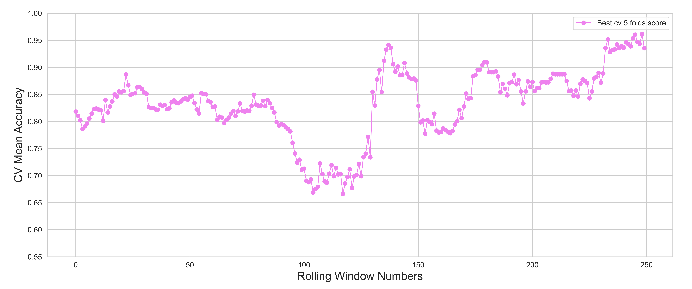

### 6. PnL Visualization
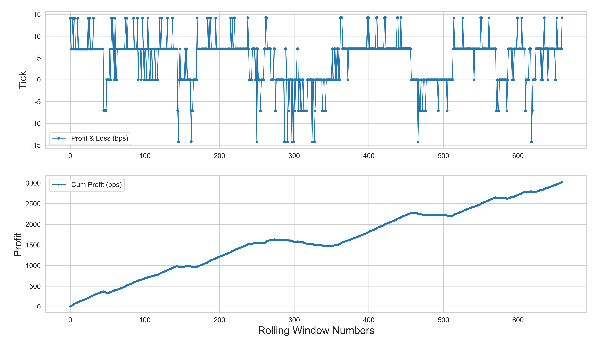

## Future Improvements

### Enhanced Feature Engineering
1. Additional Signal Types
   - Volume imbalance metrics
   - Trade flow imbalance indicators
   - Technical indicators (RSI, MACD)
   - Advanced price metrics (WAP, VWAP, TWAP)

2. Signal Processing Techniques
   - Dynamic weighting schemes for orderbook levels
   - Adaptive moving averages
   - Signal fusion using weighted combinations
   - Feature selection via Lasso regression
   - Evolutionary feature generation

### Advanced Models
1. Deep Learning Architectures
   - Convolutional Neural Networks (CNNs)
   - Gated Recurrent Units (GRU)
   - Long Short-Term Memory Networks (LSTM)
   - Attention mechanisms
   - Autoencoder architectures

2. Ensemble Methods
   - XGBoost
   - LightGBM
   - Stacked models
   - TabNet
   - Pre-trained model adaptation

### Performance Enhancements
1. Risk Management
   - Position sizing optimization
   - Stop-loss implementation
   - Dynamic risk allocation

2. Transaction Cost Analysis
   - Commission modeling
   - Market impact estimation
   - Slippage consideration
   - Latency analysis

3. Strategy Refinement
   - Adaptive parameter updating
   - Multi-asset portfolio optimization
   - Regime detection and adaptation

## Implementation Guidelines

### Best Practices
1. Data Processing
   - Implement robust data cleaning procedures
   - Handle missing data appropriately
   - Account for market microstructure effects

2. Model Development
   - Use proper cross-validation techniques
   - Implement early stopping
   - Monitor for overfitting
   - Maintain separate validation sets

3. Production Deployment
   - Implement proper logging
   - Monitor system health
   - Track performance metrics
   - Maintain failover systems

## Conclusion
This framework provides a foundation for developing sophisticated high-frequency trading strategies. While it offers a robust baseline implementation, there is significant room for customization and enhancement across all components of the system.